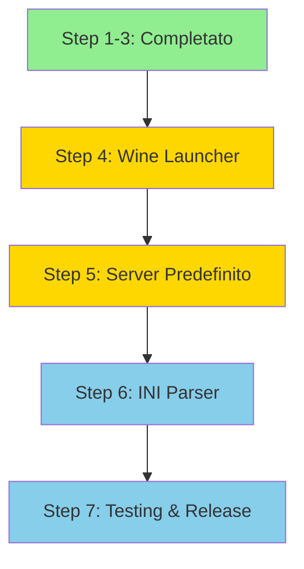

# 🛠️ Piano di Implementazione Dettagliato

**Progetto**: MHFZ-Launcher Linux Porting  
**Fase Attuale**: Step 4-5 (Game Launch + Server Config)  
**Approccio**: Sviluppo locale → Test → Branch feature → PR

---

## 📍 Roadmap Generale



**Legenda:**
- 🟩 Verde: Completato
- 🟨 Giallo: In corso (priorità)
- 🟦 Azzurro: Pianificato

---

## 🎯 Step 4: Wine/Proton Game Launcher

**Priorità**: 🔴 CRITICA  
**Tempo stimato**: 2-3 ore  
**Dipendenze**: Wine/Proton installato

### 4.1 Creare Modulo `lib_linux.rs`

#### 📝 Codice Completo

**File:** `src-tauri/src/lib_linux.rs`

```rust
//! Linux-specific game launcher using Wine/Proton

use std::path::PathBuf;
use std::process::{Command, Stdio};
use log::{info, warn};

/// Configurazione minima per avviare il gioco su Linux
pub struct MhfConfigLinux {
    pub game_folder: PathBuf,
}

/// Avvia il gioco MHFZ tramite Wine
pub fn run_linux(config: MhfConfigLinux) -> Result<(), String> {
    info!("[Linux] Starting MHFZ launcher");
    info!("[Linux] Game folder: {:?}", config.game_folder);

    // 1. Verifica che la cartella esista
    if !config.game_folder.exists() {
        return Err(format!(
            "Game folder does not exist: {:?}",
            config.game_folder
        ));
    }

    // 2. Determina WINEPREFIX
    let wine_prefix = std::env::var("WINEPREFIX").unwrap_or_else(|_| {
        let home = std::env::var("HOME").expect("HOME not set");
        format!("{}/Games/MHFZ/pfx", home)
    });
    info!("[Linux] Using WINEPREFIX: {}", wine_prefix);

    // 3. Cerca l'eseguibile del gioco
    let exe_candidates = vec![
        config.game_folder.join("mhf.exe"),       // F5 version
        config.game_folder.join("mhfo.dll"),      // ZZ SD
        config.game_folder.join("mhfo-hd.dll"),   // ZZ HD
    ];

    let exe_path = exe_candidates
        .iter()
        .find(|p| p.exists())
        .ok_or_else(|| {
            "No game executable found (mhf.exe, mhfo.dll, or mhfo-hd.dll)".to_string()
        })?;

    info!("[Linux] Found game executable: {:?}", exe_path);

    // 4. Determina quale Wine usare (wine o proton)
    let wine_cmd = detect_wine_command()?;
    info!("[Linux] Using Wine: {}", wine_cmd);

    // 5. Lancia il gioco
    info!("[Linux] Launching game...");
    let mut child = Command::new(&wine_cmd)
        .env("WINEPREFIX", &wine_prefix)
        .env("WINEDEBUG", "-all")  // Disabilita log Wine verbose
        .current_dir(&config.game_folder)
        .arg(exe_path)
        .stdout(Stdio::inherit())
        .stderr(Stdio::inherit())
        .spawn()
        .map_err(|e| format!("Failed to spawn Wine process: {}", e))?;

    info!("[Linux] Game process started (PID: {})", child.id());

    // 6. Attendi terminazione
    let status = child
        .wait()
        .map_err(|e| format!("Failed to wait for game process: {}", e))?;

    if status.success() {
        info!("[Linux] Game exited successfully");
        Ok(())
    } else {
        let code = status.code().unwrap_or(-1);
        warn!("[Linux] Game exited with code: {}", code);
        
        // Codice 102 = restart richiesto (Windows convention)
        if code == 102 {
            info!("[Linux] Restart requested");
            // TODO: Implementare logica restart se necessario
        }
        
        Err(format!("Game exited with code: {}", code))
    }
}

/// Rileva quale comando Wine usare (wine, wine64, proton, etc.)
fn detect_wine_command() -> Result<String, String> {
    // Priorità:
    // 1. WINE env var
    // 2. wine64 (preferito su sistemi 64-bit)
    // 3. wine (fallback)
    
    if let Ok(wine_path) = std::env::var("WINE") {
        return Ok(wine_path);
    }

    // Testa wine64
    if Command::new("wine64")
        .arg("--version")
        .stdout(Stdio::null())
        .stderr(Stdio::null())
        .status()
        .is_ok()
    {
        return Ok("wine64".to_string());
    }

    // Testa wine
    if Command::new("wine")
        .arg("--version")
        .stdout(Stdio::null())
        .stderr(Stdio::null())
        .status()
        .is_ok()
    {
        return Ok("wine".to_string());
    }

    Err("Wine not found. Please install wine or set WINE environment variable.".to_string())
}

/// Verifica che Wine sia configurato correttamente
pub fn check_wine_setup() -> Result<String, String> {
    let wine_cmd = detect_wine_command()?;
    
    let output = Command::new(&wine_cmd)
        .arg("--version")
        .output()
        .map_err(|e| format!("Failed to check Wine version: {}", e))?;
    
    let version = String::from_utf8_lossy(&output.stdout);
    Ok(format!("{}: {}", wine_cmd, version.trim()))
}
```

#### 📝 Integrazione in `main.rs`

**Modifica:** Aggiorna il blocco Linux in `main.rs` (linea ~1380):

```rust
#[cfg(target_os = "linux")]
{
    use std::path::PathBuf;

    let game_folder: PathBuf = config
        .mhf_folder
        .clone()
        .unwrap_or_else(|| std::env::current_dir().unwrap());

    let cfg_linux = lib_linux::MhfConfigLinux { game_folder };

    match lib_linux::run_linux(cfg_linux) {
        Ok(_) => {
            info!("Game exited normally");
            // Continua il loop per restart se necessario
        }
        Err(e) => {
            error!("Failed to launch game: {}", e);
            break;
        }
    }
}
```

---

### 4.2 Test Locali

#### ✅ Checklist Test

**Pre-requisiti:**
```bash
# Verifica Wine
wine --version
# Output atteso: wine-9.0 o superiore

# Verifica Wine prefix
echo $WINEPREFIX
# Output atteso: /home/salvatore/Games/MHFZ/pfx (o simile)
```

**Test 1: Compilazione**
```bash
cd ~/Progetti/MHFZ-Launcher
rustup override set nightly
cargo build --release
```

**Criteri successo:**
- ✅ Compila senza errori
- ✅ Nessun warning critico

**Test 2: Avvio Launcher**
```bash
cd ~/Progetti/MHFZ-Launcher
export WINEPREFIX="$HOME/Games/MHFZ/pfx"
export RUST_LOG=info
npm run tauri:dev
```

**Criteri successo:**
- ✅ Launcher si apre
- ✅ UI carica correttamente
- ✅ Nessun crash immediato

**Test 3: Login + Character Select**
```bash
# 1. Apri launcher
# 2. Inserisci credenziali Erupe
# 3. Seleziona personaggio
# 4. Verifica log nel terminale
```

**Log attesi:**
```
[Linux] Starting MHFZ launcher
[Linux] Game folder: /home/salvatore/Games/MHFZ
[Linux] Using WINEPREFIX: /home/salvatore/Games/MHFZ/pfx
[Linux] Found game executable: /home/salvatore/Games/MHFZ/mhf.exe
[Linux] Using Wine: wine64
[Linux] Launching game...
[Linux] Game process started (PID: 12345)
```

**Test 4: Game Launch Effettivo**

**Criteri successo:**
- ✅ Processo Wine parte
- ✅ Finestra di gioco appare
- ✅ Connessione al server Erupe
- ✅ Nessun crash al login

**Test 5: Exit Codes**
```bash
# Chiudi il gioco normalmente
# Verifica log:
```

**Log attesi:**
```
[Linux] Game exited successfully
```

---

### 4.3 Troubleshooting Comune

#### Problema: "Wine not found"

**Soluzione:**
```bash
# Arch Linux
sudo pacman -S wine wine-mono wine-gecko

# Ubuntu/Debian
sudo apt install wine64 wine32

# Verifica installazione
which wine64
wine64 --version
```

#### Problema: "No game executable found"

**Soluzione:**
```bash
# Verifica contenuto cartella
ls -la ~/Games/MHFZ/

# Deve contenere uno di:
# - mhf.exe (F5)
# - mhfo.dll (ZZ SD)
# - mhfo-hd.dll (ZZ HD)
```

#### Problema: "Failed to spawn Wine process"

**Soluzione:**
```bash
# Test manuale Wine
export WINEPREFIX="$HOME/Games/MHFZ/pfx"
cd ~/Games/MHFZ
wine64 mhf.exe

# Se fallisce, reinstalla Wine prefix:
wineboot --init
winetricks dotnet48 vcrun2019
```

---

## 🎯 Step 5: Server Predefinito Erupe

**Priorità**: 🔴 CRITICA  
**Tempo stimato**: 15 minuti  
**Dipendenze**: Nessuna

### 5.1 Modificare `config.rs`

**File:** `src-tauri/src/config.rs`

#### 📝 Codice Completo

```rust
#![allow(clippy::needless_update)]
use crate::Endpoint;

pub const MODERN_STYLE: u32 = 0;
pub const CLASSIC_STYLE: u32 = 1;

pub const DEFAULT_SERVERLIST_URL: &str =
    "NOT USED UNLESS SPECIFIED BY ADMIN=SERVERIP/serverlist.json";
pub const DEFAULT_MESSAGELIST_URL: &str =
    "NOT USED UNLESS SPECIFIED BY ADMIN=SERVERIP/messagelist.json";

pub fn get_default_endpoints() -> Vec<Endpoint> {
    vec![
        // ⭐ Server Erupe principale
        Endpoint {
            name: "Avalanche MHFZ (Erupe)".into(),
            url: "avalanchemhfz.ddns.net".into(),
            launcher_port: Some(8094),  // Patch server port
            game_port: Some(53310),     // Game server port
            version: mhf_iel::MhfVersion::ZZ,
            is_remote: true,
            ..Default::default()
        },
        // 🛠️ Fallback: Offline Mode
        Endpoint {
            name: "Offline-Mode".into(),
            url: "OFFLINEMODE".into(),
            is_remote: true,
            ..Default::default()
        },
    ]
}
```

---

### 5.2 Test Locali

#### Test 1: Verifica Server Predefinito

```bash
# Rebuild del progetto
cargo build --release

# Avvia launcher
npm run tauri:dev
```

**UI Check:**
- ✅ Dropdown server mostra "Avalanche MHFZ (Erupe)" come prima opzione
- ✅ "Offline-Mode" è presente come seconda opzione
- ✅ Nessun errore in console

#### Test 2: Connessione Server

```bash
# Nel launcher:
# 1. Server già selezionato: "Avalanche MHFZ (Erupe)"
# 2. Inserisci username/password
# 3. Click "Login"
```

**Criteri successo:**
- ✅ Connessione al server Erupe
- ✅ Lista personaggi caricata
- ✅ Nessun errore "server not found"

#### Test 3: Persistenza Configurazione

```bash
# 1. Chiudi launcher
# 2. Riapri launcher
# 3. Verifica che "Avalanche MHFZ" sia ancora selezionato
```

---

### 5.3 Configurazione Multi-Server (Opzionale)

Se in futuro serve aggiungere altri server:

```rust
pub fn get_default_endpoints() -> Vec<Endpoint> {
    vec![
        Endpoint {
            name: "Avalanche MHFZ (Main)".into(),
            url: "avalanchemhfz.ddns.net".into(),
            launcher_port: Some(8094),
            game_port: Some(53310),
            version: mhf_iel::MhfVersion::ZZ,
            is_remote: true,
            ..Default::default()
        },
        Endpoint {
            name: "Localhost (Test)".into(),
            url: "127.0.0.1".into(),
            launcher_port: Some(8080),
            game_port: Some(54001),
            version: mhf_iel::MhfVersion::ZZ,
            is_remote: false,  // ⚠️ Local server
            ..Default::default()
        },
        Endpoint {
            name: "Offline-Mode".into(),
            url: "OFFLINEMODE".into(),
            is_remote: true,
            ..Default::default()
        },
    ]
}
```

---

## 🔧 Step 6: INI Parser Completo (Enhancement)

**Priorità**: 🟬 MEDIA  
**Tempo stimato**: 1 ora  
**Dipendenze**: `configparser` crate

### 6.1 Aggiungere Dipendenza

**File:** `src-tauri/Cargo.toml`

```toml
[dependencies]
# ... existing dependencies ...

# Cross-platform INI parser
configparser = "3.0"
```

### 6.2 Refactor `settings.rs`

```rust
#[cfg(target_os = "linux")]
pub fn get_settings(path: &Path) -> Settings {
    use configparser::ini::Ini;
    
    let mut config = Ini::new();
    let ini_path = path.join("mhf.ini");
    
    // Carica INI o usa default
    let loaded = config.load(&ini_path).is_ok();
    
    if !loaded {
        log::warn!("Could not load mhf.ini, using defaults");
        return Settings::default();
    }
    
    Settings {
        hd_version: config
            .getbool("VIDEO", "GRAPHICS_VER")
            .ok()
            .flatten()
            .unwrap_or(true),
        fullscreen: config
            .getbool("SCREEN", "FULLSCREEN_MODE")
            .ok()
            .flatten()
            .unwrap_or(false),
        fullscreen_w: config
            .getint("SCREEN", "FULLSCREEN_RESOLUTION_W")
            .ok()
            .flatten()
            .unwrap_or(1920) as i32,
        // ... resto dei campi ...
    }
}

#[cfg(target_os = "linux")]
pub fn set_setting(path: &Path, name: &str, value: Value) -> Result<(), String> {
    use configparser::ini::Ini;
    
    let mut config = Ini::new();
    let ini_path = path.join("mhf.ini");
    
    // Carica INI esistente
    let _ = config.load(&ini_path);
    
    // Aggiorna valore
    match (name, value) {
        ("hdVersion", Value::Bool(v)) => {
            config.set("VIDEO", "GRAPHICS_VER", Some(if v { "1" } else { "0" }));
        }
        ("fullscreen", Value::Bool(v)) => {
            config.set("SCREEN", "FULLSCREEN_MODE", Some(if v { "1" } else { "0" }));
        }
        // ... altri campi ...
        _ => return Err("Unknown setting".into()),
    }
    
    // Salva su disco
    config.write(&ini_path).map_err(|e| format!("Failed to save INI: {}", e))?;
    
    Ok(())
}
```

---

## 📦 Workflow Git: Feature Branches

### Procedura Standard

**Per ogni Step:**

```bash
# 1. Crea branch feature
git checkout -b feature/step-4-wine-launcher

# 2. Implementa modifiche
# (codice qui)

# 3. Test locali
cargo test
cargo build --release
npm run tauri:dev
# ... test manuali ...

# 4. Commit
git add src-tauri/src/lib_linux.rs
git add src-tauri/src/main.rs
git commit -m "feat(linux): implement Wine/Proton game launcher

- Add lib_linux.rs with Wine process spawning
- Detect wine/wine64 automatically
- Handle WINEPREFIX environment variable
- Support mhf.exe, mhfo.dll, mhfo-hd.dll detection
- Add comprehensive error handling

Tested on:
- Arch Linux with Wine 9.0
- Game launches successfully
- Exit codes handled correctly"

# 5. Push branch
git push origin feature/step-4-wine-launcher

# 6. Crea Pull Request su GitHub
# Titolo: "feat(linux): Implement Wine/Proton game launcher"
# Descrizione: vedi template sotto
```

### Template Pull Request

```markdown
## 🎯 Descrizione

Implementa il launcher Wine/Proton per avviare MHFZ su Linux.

## ✅ Modifiche

- 🆕 Nuovo file: `src-tauri/src/lib_linux.rs`
- ♻️ Modificato: `src-tauri/src/main.rs` (blocco Linux)

## 🧪 Funzionalità

- Rileva automaticamente `wine` o `wine64`
- Supporta env var `WINEPREFIX` e `WINE`
- Trova automaticamente l'eseguibile (`mhf.exe`, `mhfo.dll`, `mhfo-hd.dll`)
- Gestione exit codes (incluso codice 102 per restart)
- Logging dettagliato per debugging

## 🧑‍💻 Testing

### Ambiente di Test
- **OS**: Arch Linux (kernel 6.x)
- **Wine**: 9.0 (wine64)
- **Prefix**: `~/Games/MHFZ/pfx`
- **Server**: Avalanche MHFZ (Erupe)

### Test Eseguiti
- ✅ Compilazione senza errori
- ✅ Launcher si apre correttamente
- ✅ Login al server Erupe
- ✅ Selezione personaggio
- ✅ Game launch con Wine
- ✅ Connessione al server di gioco
- ✅ Exit pulito senza crash

### Screenshot

(aggiungi screenshot se disponibili)

## 📝 Checklist

- [x] Codice compila senza warning
- [x] Test manuali completati
- [x] Documentazione aggiornata
- [x] Commit message segue conventional commits
- [x] Nessun file sensibile committato

## 🔗 Issue Correlati

Closes #1 (se esiste issue tracker)

## 📌 Note

- **Non** include friends list injection (da implementare separatamente)
- Testato solo su Arch Linux, richiede test su Ubuntu/Debian
- Prefix Wine deve essere configurato manualmente dall'utente
```

---

## 📅 Timeline Proposta

| Step | Task | Tempo | Scadenza Proposta |
|------|------|-------|-------------------|
| 4.1 | Creare `lib_linux.rs` | 1h | Giorno 1 |
| 4.2 | Test locali Wine launcher | 1h | Giorno 1 |
| 4.3 | PR + review | 30min | Giorno 2 |
| 5.1 | Modificare `config.rs` | 15min | Giorno 2 |
| 5.2 | Test server predefinito | 15min | Giorno 2 |
| 5.3 | PR + review | 15min | Giorno 2 |
| 6.1 | Refactor INI parser | 1h | Giorno 3 |
| 6.2 | Test read/write INI | 30min | Giorno 3 |
| 6.3 | PR + review | 15min | Giorno 3 |

**Totale stimato**: ~5-6 ore di lavoro effettivo

---

## 🔗 Link Utili

- [Wine Documentation](https://wiki.winehq.org/)
- [GE-Proton Releases](https://github.com/GloriousEggroll/proton-ge-custom/releases)
- [Tauri Documentation](https://tauri.app/v1/guides/)
- [Rust std::process](https://doc.rust-lang.org/std/process/)

---

**Ultima revisione**: 11 Dicembre 2025  
**Prossimo aggiornamento**: Dopo completamento Step 4
